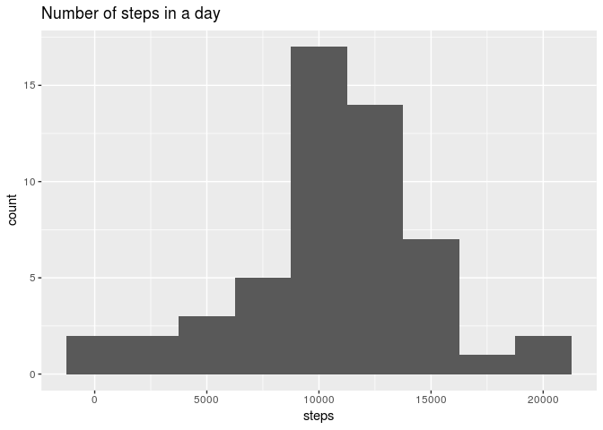
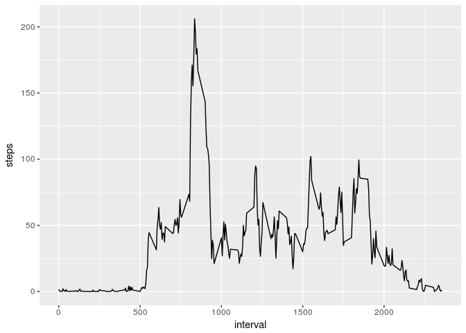
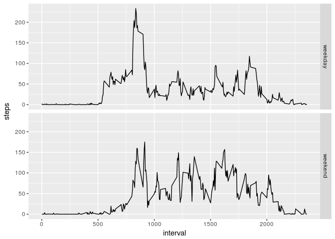

Reproducible Research: Peer Assignment 1
========================================================


This is the first project in the "Reproducible Research" Coursera course. In the project's boundaries I download the [activity data sample](https://d396qusza40orc.cloudfront.net/repdata%2Fdata%2Factivity.zip), process the data and make some explanatory graphs.

### Loading and preporcessing data

First of all, we need to download .zip file and unzip in to the working directory, which has been chosen before.

```r
    fileURL <- "https://d396qusza40orc.cloudfront.net/repdata%2Fdata%2Factivity.zip"
    temp <- tempfile()
    download.file(fileURL, temp)
    unzip(temp,exdir = getwd())
    unlink(temp)
```

Now we have "activity.csv" file in the working directory. Then we need to read its content. Also it is useful to convert the "date" column to date format. "Interval" column content can also be converted, but it is not necessary for our purposes, and I've decided not to do it. And finally, I've included the used libraries.

```r
    rawData <- read.csv(file = "activity.csv", stringsAsFactors = FALSE)
    rawData$date <- as.Date(rawData$date,"%Y-%m-%d")
    library(ggplot2)
    library(chron)
```
### What is the mean of total number of steps taken per day?

The first task is to see a histogram of total daily step numbers, their mean and median (mean is rounded to make its format more useful).


```r
    dailyData <- aggregate(steps ~ date, rawData, FUN = sum)
    dailyMean <- mean(dailyData$steps)
    intDailyMean <- as.integer(round(dailyMean))
    dailyMedian <- median(dailyData$steps)
    qplot(steps, data = dailyData, binwidth = 2500, main = "Number of steps in a day")
```

<!-- -->

Average daily number of steps is equal to 10766, median is 10765.

### What is the average daily activity pattern?

The second task is to see intraday data behaviour. To do it I used the code below.

```r
    intradayData <- aggregate(steps ~ interval, rawData, FUN = mean)
    maxInterval <- intradayData$interval[intradayData$steps == max(intradayData$steps)]
    strMaxInterval <- paste(c(substr(as.character(maxInterval), 1, 1), substr(as.character(maxInterval), 2,3)), collapse=":")
    ggplot(intradayData, aes(interval, steps)) + geom_line()
```

<!-- -->
  
Interval containing maximum number of steps starts from 8:35.

### Imputing missing values

Next task is to design NA values filling algorithm and repeat task 1 using filled dataset. I decided to use mean value for a 5-minute time period across all days as a proxy. The filling algorithm and histogram are provided below.


```r
    filledData <- rawData
    filledData$steps[is.na(filledData$steps)] <- 
        intradayData$steps[intradayData$interval == filledData$interval[is.na(filledData$steps)]]
    dailyFilledData <- aggregate(steps ~ date, filledData, FUN = sum)
    dailyMeanF <- mean(dailyFilledData$steps)
    intDailyMeanF <-as.integer(round(dailyMeanF))
    dailyMedianF <- median(dailyFilledData$steps)
    intDailyMedianF <- as.integer(round(dailyMedianF))
    qplot(steps, data = dailyFilledData, binwidth = 2500, main = "Number of steps in a day")
```

<!-- -->

The mean and median values for filled data are equal to 10766 and 10766 correspondingly. Looking at the graph, mean and median values we can draw a conclusion that the filling algorithm does not have significant impact on them.

### Are the differences in activity patterns between weekdays and weekends?

And the last task is to check influence of holidays on average daily steps distribution pattern. The following code is used to get the results:

```r
    dayType = factor(is.weekend(filledData$date),labels = c("weekday","weekend"), 
                 levels = c(FALSE, TRUE))
    filledData$weekend <- dayType
    dailyFilledWeekData <- aggregate(steps ~ interval + weekend, filledData, FUN = mean)
    ggplot(dailyFilledWeekData, aes(interval, steps)) + geom_line() + facet_grid(weekend~.)
```

<!-- -->

It can be seen that for "weekday" and "weekend" categories different patterns are observed. For "weekday" category there is the highes morning peak (people go at work) and the set of evening peaks which are smaller (people go from work). For "weekend" category the distribution is more or less uniform.
